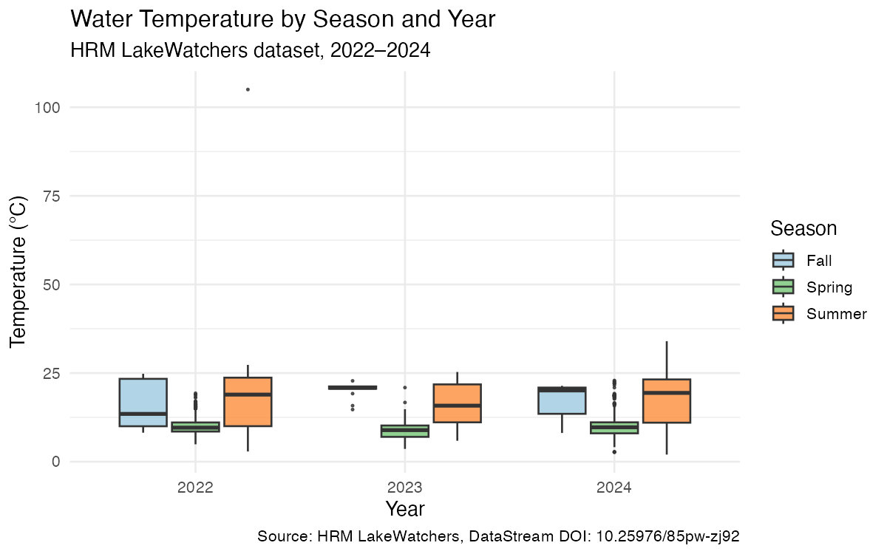
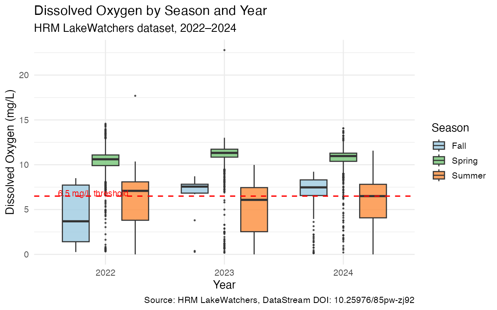
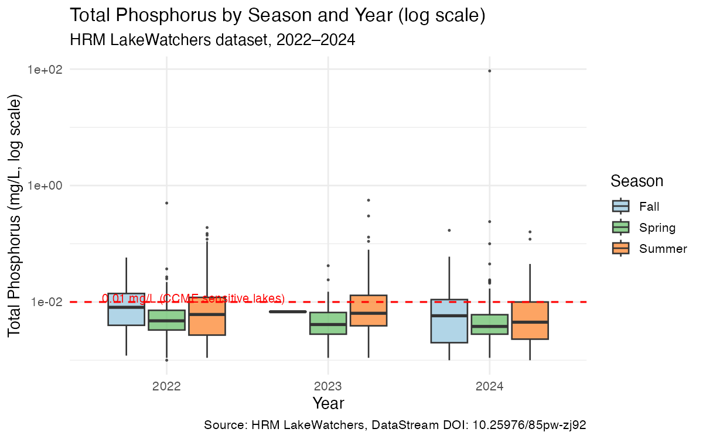

## Introduction

Halifax Regional Municipality manages dozens of urban lakes used for
recreation, drinking water supply, and ecosystem services. In recent
summers, HRM has issued repeated blue-green algae advisories at
supervised lake beaches. This analysis uses the open
[HRM LakeWatchers dataset](https://doi.org/10.25976/85pw-zj92)
to examine seasonal patterns in key water quality indicators across
154 monitored lakes from 2022 to 2024.

**Research questions:**

1. How do water temperature, dissolved oxygen, and total phosphorus
   vary by season across HRM lakes?
2. How frequently do measurements exceed Canadian water quality
   guidelines?

---

## Data

```{r}
#| label: setup
#| message: false
#| warning: false
library(tidyverse)
library(lubridate)
library(knitr)

df <- read_csv("data/processed/lakewatchers_clean.csv",
               show_col_types = FALSE)
```

The dataset contains **`r nrow(df)` observations** across
**`r length(unique(df$LocationId))` monitoring locations**,
spanning `r min(df$Date)` to `r max(df$Date)`.

```{r}
#| label: tbl-params
#| tbl-cap: "Observations per parameter"
df %>%
  group_by(Parameter) %>%
  summarise(N = n(), Locations = n_distinct(LocationId)) %>%
  arrange(desc(N)) %>%
  kable()
```

---

## Water Temperature

```{r}
#| label: fig-temp
#| fig-cap: "Water temperature by season and year."

```

Summer surface temperatures range from roughly 10°C to over 30°C,
with medians around 18–22°C — warm enough to support blue-green algal
growth. Seasonal patterns are consistent across all three years.

---

## Dissolved Oxygen

```{r}
#| label: fig-do
#| fig-cap: "Dissolved oxygen by season and year. Red line = 6.5 mg/L CCME guideline."

```

```{r}
#| label: tbl-do
#| tbl-cap: "DO exceedances below 6.5 mg/L"
df %>%
  filter(Parameter == "DO_mgL", Season != "Winter") %>%
  mutate(below = ResultValue < 6.5) %>%
  group_by(Year, Season) %>%
  summarise(Total = n(), Below = sum(below, na.rm = TRUE),
            Pct = round(100 * Below / Total, 1), .groups = "drop") %>%
  kable(col.names = c("Year","Season","Total","Below 6.5 mg/L","%"))
```

Summer dissolved oxygen consistently falls below the 6.5 mg/L
cold-water aquatic life threshold across all three years, consistent
with warm-season thermal stratification.

---

## Total Phosphorus

```{r}
#| label: fig-tp
#| fig-cap: "Total phosphorus by season and year (log scale). Red line = 0.01 mg/L CCME guideline."

```

Median TP values sit near the CCME sensitive-lake threshold of
0.01 mg/L, placing many HRM lakes in a transitional trophic state.

---

## Discussion

HRM lakes show consistent summer dissolved oxygen depletion and
phosphorus levels at the boundary of eutrophication guidelines.
These patterns are stable across 2022–2024, suggesting structural
nutrient loading rather than isolated events.

**Limitation:** 2.5 years is insufficient for trend detection.
Depth-stratified sampling would strengthen interpretation of DO values.

---

## Methods

Data retrieved via the DataStream API (`datastreamr` v2.0.1).
Filtered to 7 parameters; removed missing values and implausible
readings (temp > 40°C). Sites with fewer than 5 observations per
parameter or fewer than 3 parameters measured were excluded,
leaving 154 sites and 34,446 observations.

---

## Data citation

> Halifax Regional Municipality (2025). HRM LakeWatchers (dataset).
> 2.0.0. DataStream. https://doi.org/10.25976/85pw-zj92

## Session info

```{r}
#| code-fold: true
sessionInfo()
```